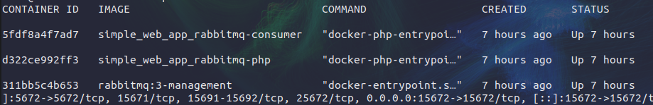

## Requisitos

É necessário ter pré instalado na máquina de destino as ferramentas:

```bash
  git
  php^8
  composer
  docker
```

## Instalação / Deploy

As instruções detalhadas de instalação desta aplicação envole o seguinte processo:

- **Clonar o Repositório:**
  ```bash
  git clone https://github.com/pedromoreira49/simple_web_app_rabbitmq.git
  cd simple_web_app_rabbitmq
  ```
- **Instalar Dependências:**
  ```bash
  composer install
  ```
- **Variáveis de Ambiente:** Definir todas as variáveis de ambiente necessárias para a conexão com o RabbitMQ e outras configurações específicas da aplicação.
  ```bash
  cp .env.example .env
  ```
- **Configuração:** Configurações de conexão com o RabbitMQ (host, porta, credenciais, nome da fila) podem precisar ser definidas em variáveis de ambiente ou em um arquivo de configuração.

  ```bash
  SMTP_HOST=
  SMTP_PORT=
  SMTP_USERNAME=
  SMTP_PASSWORD=
  SMTP_FROM=
  SMTP_FROM_NAME=
  RABBITMQ_USER=
  RABBITMQ_PASSWORD=
  ```

- **Configuração do Ambiente:** Garantir que todos os pré-requisitos e dependências estejam instalados no ambiente de produção.

- **Execução:** Utilizar Docker/Docker Compose para conteinerização para manter a aplicação em execução de forma robusta e persistente.

  ```bash
  docker compose up -d
  ```

**Observação Importante:** Recomenda-se consultar o status dos containers para checar sua disponibilidade. Após o compando `docker compose up -d` deve-se ter 3 containers rodando na máquina alvo. Para verificar, rode o comando:

```bash
docker ps
```

O retorno deve ser algo parecido com a seguinte imagem:

